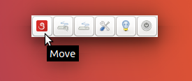
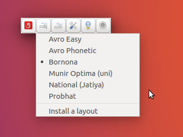

We're proudly announcing the [release](https://github.com/OpenBangla/OpenBangla-Keyboard/releases/tag/1.1.0) of OpenBangla Keyboard version **1.1.0**, an Open Source Bengali input method.

The most important news that now you will enjoy writing in phonetic method(Avro Phonetic) with OpenBangla Keyboard as like as with Avro Keyboard!

For moving the Topbar easily we have now added a new button! So it'd be bit easier when moving the Topbar 😀.

In this release we have also imported some keyboard layouts from [Avro Keyboard](https://www.omicronlab.com/avro-keyboard.html). Now you have got piles of keyboard layouts!

When typing in phonetic mode(Avro Phonetic), you can now select your choice by clicking.

Download the new release from [here](https://openbangla.github.io/download) and see the [change log](https://github.com/OpenBangla/OpenBangla-Keyboard/blob/1.1.0/CHANGELOG.md#110) for more details!
